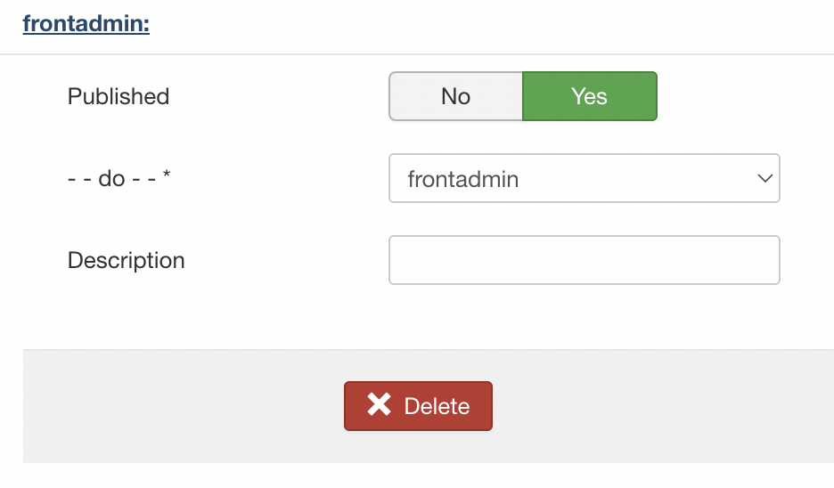
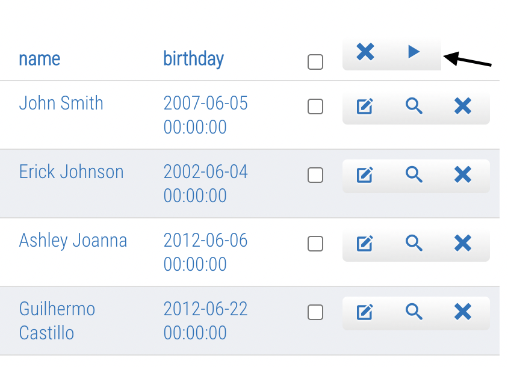
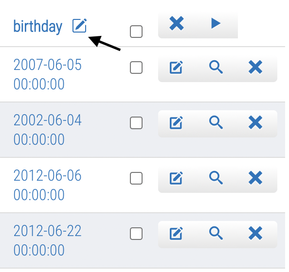
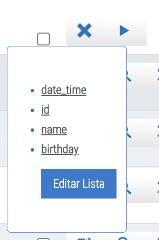
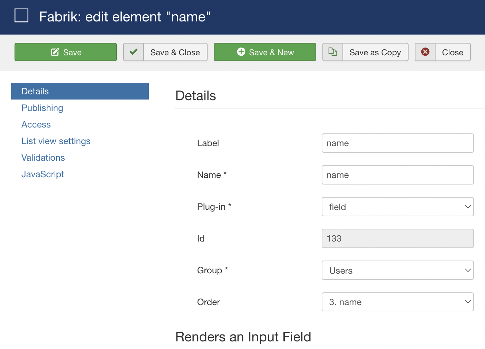
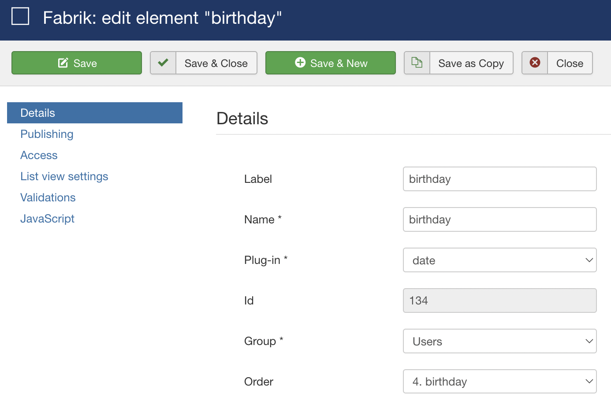

# FrontAdmin Plugin

  

  

## Conteúdo

- [Sobre](#sobre)
- [Configuração](#configuração)
- [Uso](#uso)
  - [Botão Editar](#botão-editar)

## 💭 Sobre

O plugin frontadmin tem como missão facilitar a gestão de registros em uma lista. Dessa forma, o usuário pode modificar uma lista sem precisar ir para a área administrativa do Joomla.

## ⚙️ Configuração

A configuração do plugin é simples! Basta adicioná-lo na aba de plugins da Lista:

## 💻 Uso

Ao abrir uma lista no navegador, já é possível visualizar novos botões na interface:

Com o mouse em cima da label, outro botão é revelado

### Botão Editar

  

 

Edita os elementos da lista. Sendo assim, ao clicar em qualquer uma das opções (neste caso, date_time, id, name e birthday), será aberto a janela administrativa do Joomla:

O mesmo acontece com o botão que está no hover do nome do elemento:

