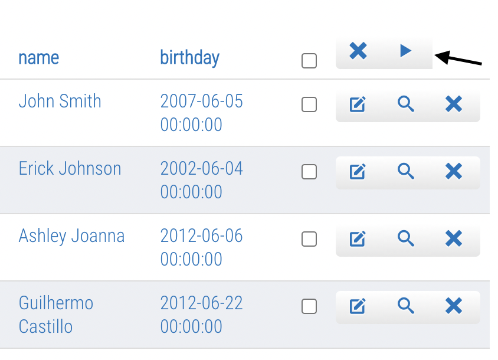
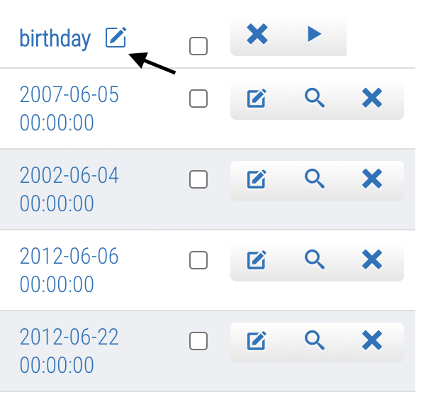

# FrontAdmin Plugin

The frontadmin plugin's mission is to facilitate the management of records in a list. In this way, the user can modify a list without having to go to the Joomla administrative area.

## Contents

- [Configurations](#configurations)
- [How to use](#how-to-use)
  - [Edit button](#edit-button)

### Configurations

Plugin setup is simple! Just add it in the List plugins tab:

### How to use

When opening a list in the browser, it is already possible to visualize new buttons in the interface:

With the mouse over the label, another button is revealed:

#### Edit button

  

 

Edit list elements. Therefore, when clicking on any of the options (in this case, date_time, id, name and birthday), the Joomla administrative window will open:

The same happens with the button that hovers over the element's name:

